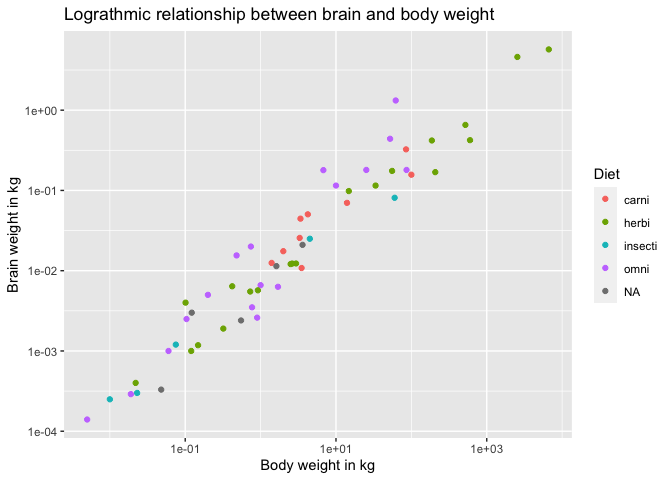
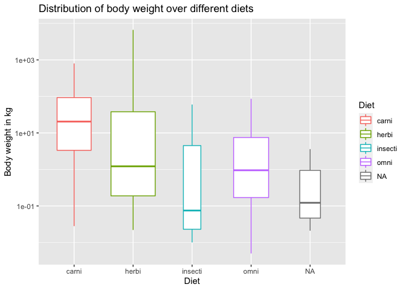
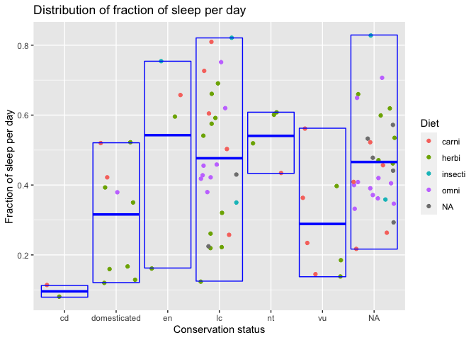
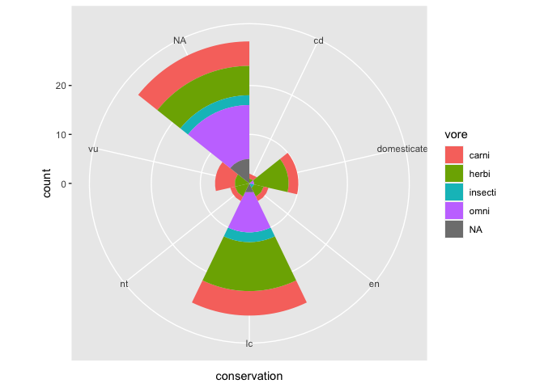

MA \[46\]15 Homework 1
================
Reshma Ramaiah

In this homework I’m analyzing the `msleep` dataset from package
`ggplot2`. I start by loading the packages:

``` r
library(tidyverse)
```

    ## ── Attaching packages ─────────────────────────────────────── tidyverse 1.3.1 ──

    ## ✓ ggplot2 3.3.5     ✓ purrr   0.3.4
    ## ✓ tibble  3.1.2     ✓ dplyr   1.0.7
    ## ✓ tidyr   1.1.3     ✓ stringr 1.4.0
    ## ✓ readr   1.4.0     ✓ forcats 0.5.1

    ## ── Conflicts ────────────────────────────────────────── tidyverse_conflicts() ──
    ## x dplyr::filter() masks stats::filter()
    ## x dplyr::lag()    masks stats::lag()

``` r
msleep
```

    ## # A tibble: 83 x 11
    ##    name   genus vore  order conservation sleep_total sleep_rem sleep_cycle awake
    ##    <chr>  <chr> <chr> <chr> <chr>              <dbl>     <dbl>       <dbl> <dbl>
    ##  1 Cheet… Acin… carni Carn… lc                  12.1      NA        NA      11.9
    ##  2 Owl m… Aotus omni  Prim… <NA>                17         1.8      NA       7  
    ##  3 Mount… Aplo… herbi Rode… nt                  14.4       2.4      NA       9.6
    ##  4 Great… Blar… omni  Sori… lc                  14.9       2.3       0.133   9.1
    ##  5 Cow    Bos   herbi Arti… domesticated         4         0.7       0.667  20  
    ##  6 Three… Brad… herbi Pilo… <NA>                14.4       2.2       0.767   9.6
    ##  7 North… Call… carni Carn… vu                   8.7       1.4       0.383  15.3
    ##  8 Vespe… Calo… <NA>  Rode… <NA>                 7        NA        NA      17  
    ##  9 Dog    Canis carni Carn… domesticated        10.1       2.9       0.333  13.9
    ## 10 Roe d… Capr… herbi Arti… lc                   3        NA        NA      21  
    ## # … with 73 more rows, and 2 more variables: brainwt <dbl>, bodywt <dbl>

## Question 1

``` r
ggplot(msleep) + 
  geom_point(aes(x = bodywt, y = brainwt, color = vore)) + 
  labs(x = "Body weight in kg", y = "Brain weight in kg", color = "Diet") +
  scale_x_log10() + scale_y_log10() +
  ggtitle("Lograthmic relationship between brain and body weight")
```

<!-- -->

The relationship between body weight and brain weight of different
animals look linear after the log transformations.

## Question 2

``` r
ggplot(msleep) + 
  geom_boxplot(aes(x = vore, y = bodywt, color = vore),varwidth = TRUE) +
  labs(x = "Diet", y = "Body weight in kg", color = "Diet") +
  scale_y_log10() +
  ggtitle("Distribution of body weight over different diets")
```

<!-- -->

Animals belonging to different diet groups have different average body
weight. Carnivores have the highest average body weight, whereas insects
along with unknown animals have the least average body weight.
Herbivores and omnivores almost have equal average body weight.

## Question 3

``` r
ggplot(msleep,aes(x = conservation, y = sleep_total/24, color = vore)) + 
  geom_point(position = 'jitter')+
  stat_summary(fun = mean, fun.min = min, fun.max = max, geom = "crossbar", color = 'blue') +
  labs(x = "Conservation status", y = "Fraction of sleep per day", color = "Diet")+
  ggtitle("Distribution of fraction of sleep per day")
```

<!-- -->

From the figure it can be interpreted that animals with higher risk of
extinction sleep longer in a day than animals with low risk of
extinction.

## Question 4

``` r
ggplot(msleep, aes(x = conservation,fill=vore)) + 
  geom_bar(width =1) +
  coord_polar()
```

<!-- -->
